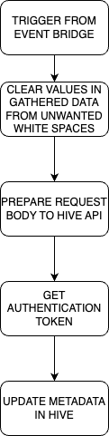

# woody_flipflop_parse_metadata_fourth_step

This repository represents fourth step in gathering, extracting and
updating metadata in sonyhive api platform. Inputs might be coming 
from many sources so the key to the overhaul flow is to be adaptive.

## Installation
This repository i just a representation of Lambda function stored in
company AWS account. Every test should be run in AWS and be verified
in CloudWatch. Main function and a starting point of this step starts
with lambda.py, and it's handler() 

## Usage

### High level overview
Below we present high level overview of the algorithm for the Fourth
step.

  

Fourth step purpose is to send metadata to Hive API

### Important configuration and environment variables

#### Environment Variables

EV for this step represent configurations id's and names:
	
- APP_CONFIG_APP_ID	
- AUTHENTICATION_URL
- LOGIN_NAME
- PASSWORD_FOR_LOGIN
- SECRET_NAME
- UPDATE_URL
